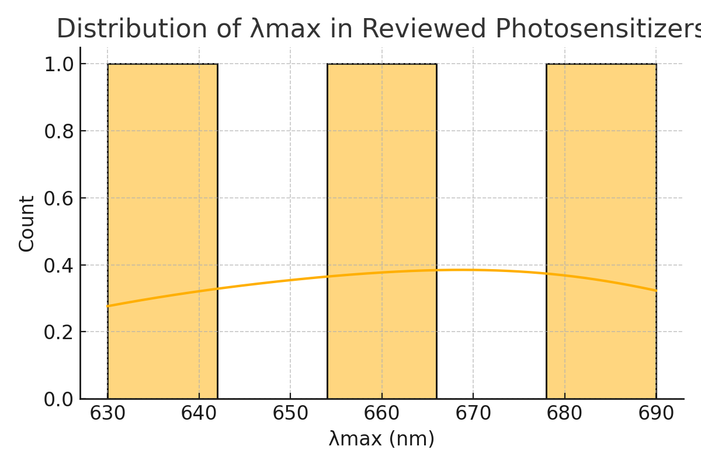

# TD-DFT Review: Photosensitizer Modeling for Photodynamic Therapy

This repository contains a structured literature review of studies applying TD-DFT (Time-Dependent Density Functional Theory) to model the electronic behavior of photosensitizers used in photodynamic therapy (PDT).

## 📁 Contents
- `photosensitizer_matrix.csv`: Structured matrix of reviewed studies.
- `analyze_matrix.ipynb`: Jupyter notebook for basic visualizations.
- `workflow_summary.md`: Conceptual TD-DFT simulation workflow.
- `plot_triplet_vs_ros.png`: Triplet energy vs. ROS yield plot.
- `plot_lambda_distribution.png`: Histogram of λmax values.

## 🧪 Research Focus
This synthesis explores:
- Electronic transitions (S0 → S1, T1)
- Triplet state energies and singlet oxygen yields
- TD-DFT methods in predicting photophysical behavior
- Applications to photosensitizer selection and PDT optimization

---

## 📊 Visual Analysis

**Triplet State Energy vs. ROS Yield**  

**Distribution of λmax in Reviewed Photosensitizers**  

---

## 🔍 Author
🔗 [LinkedIn](https://linkedin.com/in/shylett-sonam-anthony-20a40b1b3)
